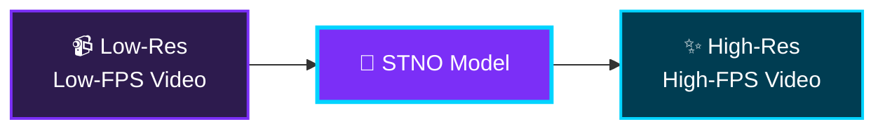
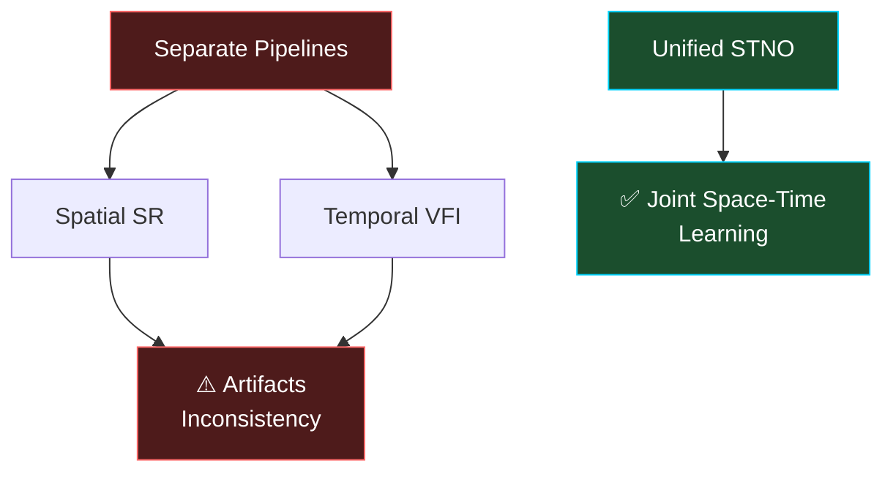
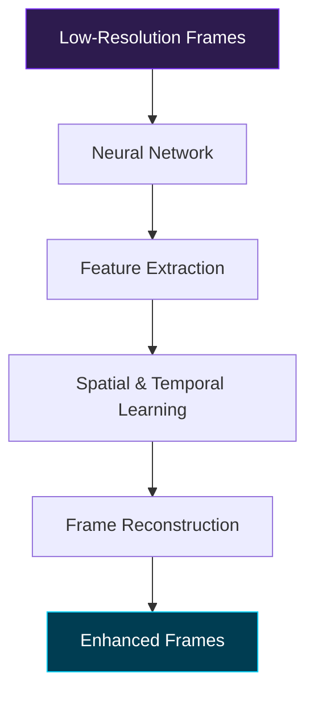
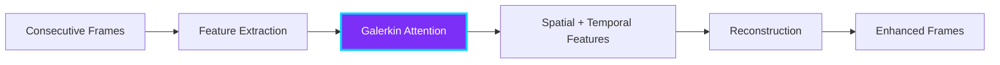
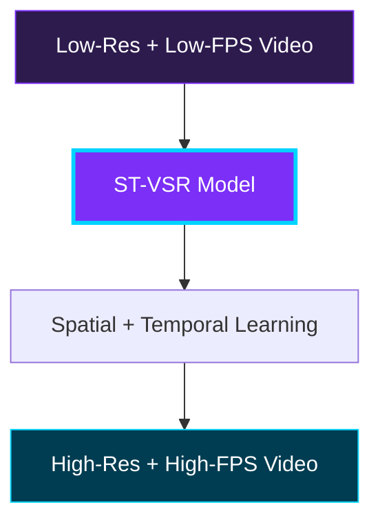
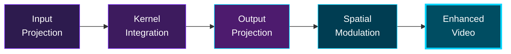
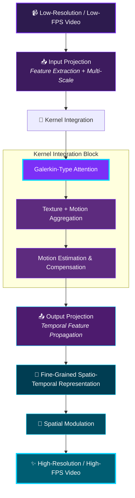
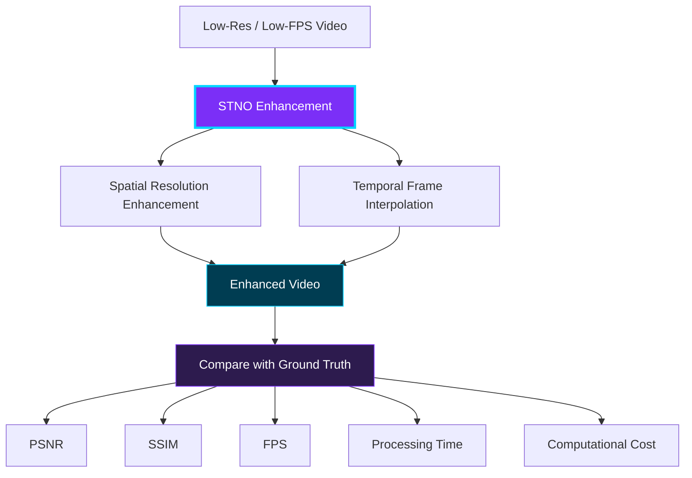
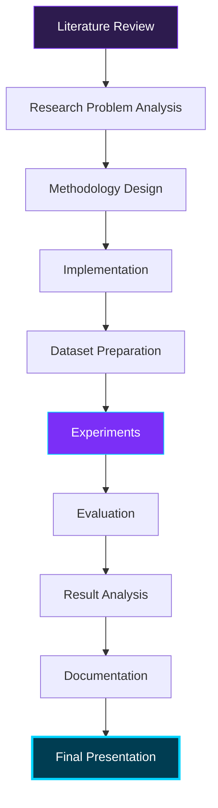

<div align="center">


<br/>

[](https://www.python.org/)
[](https://pytorch.org/)
[](https://opencv.org/)
[](https://developer.nvidia.com/cuda-zone)


<br/>

### 🎬 Watch the Project Explainer

<a href="https://www.youtube.com/watch?v=msC5GK9aV9Q" target="_blank">
  
</a>

<br/>

[](https://www.youtube.com/watch?v=msC5GK9aV9Q)

<sub>👆 Click the thumbnail to play the video</sub>

</div>

---

<div align="center">

### 🧭 Quick Navigation

<table>
<tr>
<td align="center" width="25%">

**📌 [Overview](#-1-project-overview)**
<br/><sub>What & why</sub>

</td>
<td align="center" width="25%">

**🔬 [Methodology](#-7-proposed-methodology)**
<br/><sub>How it works</sub>

</td>
<td align="center" width="25%">

**📊 [Results](#-12-results)**
<br/><sub>PSNR / SSIM / FPS</sub>

</td>
<td align="center" width="25%">

**⚙️ [Get Started](#️-14-installation)**
<br/><sub>Install & run</sub>

</td>
</tr>
</table>

</div>

<details>
<summary><b>📖 Click to expand the full table of contents</b></summary>

<br/>

| # | Section | # | Section |
|:-:|---|:-:|---|
| 1 | [Project Overview](#-1-project-overview) | 10 | [Evaluation Metrics](#-10-evaluation-metrics) |
| 2 | [Problem Statement](#-2-problem-statement) | 11 | [Experiments](#-11-experiments) |
| 3 | [Technology Stack](#️-3-technology-stack) | 12 | [Results](#-12-results) |
| 4 | [What is ST-VSR?](#-4-what-is-st-vsr) | 13 | [Project Structure](#-13-project-structure) |
| 5 | [Research Motivation](#-5-research-motivation) | 14 | [Installation](#️-14-installation) |
| 6 | [Base Paper](#-6-base-paper) | 15 | [Usage](#-15-usage) |
| 7 | [Proposed Methodology](#-7-proposed-methodology) | 16 | [Project Team](#-16-project-team) |
| 8 | [System Architecture](#️-8-system-architecture) | 17 | [References](#-17-references) |
| 9 | [Datasets](#-9-datasets) | — | [Roadmap](#-project-roadmap) |

</details>

---

## 📌 1. Project Overview

> **In one line:** A research system that takes a blurry, choppy video and makes it **sharper and smoother at the same time** — using a single unified neural operator instead of two separate models.

The **Space-Time Neural Operator Based Video Enhancement System** is a research-oriented AI project that improves the quality of low-resolution and low-frame-rate videos.

The system targets **Space-Time Video Super-Resolution (ST-VSR)**, where spatial resolution and temporal resolution are improved *together* rather than in sequence. It consumes consecutive low-resolution frames and produces high-resolution frames with smoother motion.

Our approach builds on the **Space-Time Neural Operator (STNO)** concept, which learns spatial and temporal relationships directly from video data. The architecture incorporates **Galerkin Attention** for space-time feature learning and for handling motion between consecutive frames.

<div align="center">



</div>

<details>
<summary><b>🎯 What this project investigates</b></summary>

<br/>

- ✅ Increasing the **spatial resolution** of video frames
- ✅ Increasing the **temporal frame rate** through frame interpolation
- ✅ Learning spatial and temporal relationships using **neural operators**
- ✅ Handling **motion** between consecutive video frames
- ✅ Evaluating video quality using **PSNR** and **SSIM**
- ✅ Comparing against **baseline** video enhancement methods

</details>

<details>
<summary><b>🚧 Scope & limitations</b></summary>

<br/>

The project focuses on **low-resolution video enhancement and frame-rate improvement**. It does **not** aim to provide professional restoration for severely corrupted or highly degraded videos within the project timeline.

</details>

---

## 🎯 2. Problem Statement

<table>
<tr>
<td width="50%" valign="top">

### ❌ The Problem

Low-resolution, low-frame-rate videos carry limited visual detail and insufficient temporal information — common in footage from older cameras or under bandwidth constraints.

Conventional methods treat **spatial upscaling** and **temporal interpolation** as two separate tasks. This loses visual detail and introduces motion inconsistencies, especially in scenes with large or complex motion.

Even modern deep-learning methods struggle to accurately learn the relationship between spatial detail and motion across frames. Large object movements and complex textures lead to **inaccurate motion estimation** and **visual artifacts**.

</td>
<td width="50%" valign="top">

### ✅ Our Direction

A **Space-Time Neural Operator (STNO)** based approach that learns spatial and temporal relationships *jointly* from video data, improving resolution and frame rate in a single unified pass.



</td>
</tr>
</table>

---

## 🛠️ 3. Technology Stack

<div align="center">


</div>

<br/>

<details open>
<summary><b>🔍 Expand each technology to see how we use it</b></summary>

<br/>

<details>
<summary>🐍 &nbsp;<b>Python</b> — primary development language</summary>

<br/>

Python drives the entire pipeline: video and frame processing, dataset preparation, neural network implementation, model training, evaluation, and metric computation (PSNR / SSIM).

```text
Input Video → Python Video Processing → Frame Preparation
            → AI Model → Enhanced Frames → Evaluation → Output Video
```

</details>

<details>
<summary>🧠 &nbsp;<b>Neural Networks</b> — feature learning & reconstruction</summary>

<br/>

A neural network learns patterns and relationships from data. Here it receives low-resolution frames and learns to reconstruct frames with improved spatial detail and temporal information.



</details>

<details>
<summary>⚛️ &nbsp;<b>Neural Operators</b> — the core research direction</summary>

<br/>

The **Space-Time Neural Operator (STNO)** learns the mapping between coarse-grained video representations and fine-grained representations rich in spatial and temporal information.

```text
Low-Resolution Frames → Neural Operator
                      → Spatio-Temporal Representation → Enhanced Video
```

</details>

<details>
<summary>🎯 &nbsp;<b>Galerkin Attention</b> — linear-complexity global attention</summary>

<br/>

Galerkin-type attention provides a **global receptive field with linear computational complexity**. In our project it learns relationships between features of consecutive frames — critical when there is significant motion.



</details>

<details>
<summary>👁️ &nbsp;<b>Computer Vision</b> — frame processing & quality analysis</summary>

<br/>

| Task | Purpose |
|---|---|
| Video frame processing | Decode, prepare, and batch frames |
| Spatial resolution enhancement | Reconstruct missing detail |
| Temporal frame interpolation | Generate intermediate frames |
| Video reconstruction | Reassemble the enhanced sequence |
| Visual quality analysis | Inspect artifacts and fidelity |

</details>

<details>
<summary>⚡ &nbsp;<b>GPU Computing</b> — training & inference acceleration</summary>

<br/>

Video super-resolution processes many frames with heavy neural computation. GPU acceleration is used for model training, frame processing, inference, running experiments, and evaluation.

</details>

<details>
<summary>🔧 &nbsp;<b>Git & GitHub</b> — collaboration and research tracking</summary>

<br/>

Source-code management, version control, experiment tracking, and team collaboration.

</details>

</details>

---

## 🎥 4. What is ST-VSR?

**Space-Time Video Super-Resolution** improves both the **spatial** and **temporal** resolution of a video.

<table>
<tr>
<th width="50%">🖼️ Spatial Super-Resolution</th>
<th width="50%">⏱️ Temporal Interpolation</th>
</tr>
<tr>
<td valign="top">

Increases the resolution of individual frames and reconstructs missing visual detail.

```text
Low-Resolution Frame
        ↓
Spatial Super-Resolution
        ↓
High-Resolution Frame
```

</td>
<td valign="top">

Generates new intermediate frames between existing ones for smoother motion.

```text
Frame 1 ─────────── Frame 2
           ↓
Frame 1 ─ Frame 1.5 ─ Frame 2
```

</td>
</tr>
</table>

<div align="center">



</div>

---

## 💡 5. Research Motivation

> Improving resolution and frame rate **separately** causes visual inconsistency — particularly under large or complex motion.

This motivates a **Space-Time Neural Operator**, which can learn the relationship between spatial information and temporal information across consecutive frames.

Our project investigates whether a neural-operator-based approach can **jointly** improve spatial quality and temporal smoothness while keeping video processing efficient — and how **Neural Operators + Galerkin Attention** can be used for effective space-time enhancement.

---

## 📚 6. Base Paper

<div align="center">

### *"Space-Time Video Super-resolution with Neural Operator"*

[](https://arxiv.org/abs/2404.06036)

</div>

The paper proposes an **STNO** approach for ST-VSR, learning the relationship between coarse-grained video representations and fine-grained representations containing rich spatial and temporal information.

<details>
<summary><b>🧩 The two challenges it addresses</b></summary>

<br/>

| Challenge | Description |
|---|---|
| **Efficient MEMC** | Motion Estimation and Motion Compensation is computationally expensive |
| **Extreme motion** | Large displacements between frames break conventional alignment |

**Solution:** a **Galerkin-type Attention** mechanism providing a global receptive field with **linear** computational complexity, used for motion estimation, frame alignment, and temporal interpolation.

</details>

<div align="center">



</div>

---

## 🔬 7. Proposed Methodology

Our method processes consecutive low-resolution frames through four stages.

<details open>
<summary><b>Expand each stage</b></summary>

<br/>

<details>
<summary><b>Stage 1 — 📥 Input Projection</b></summary>

<br/>

Input frames pass through feature extraction layers to obtain representations at multiple scales.

```text
Low-Resolution Video Frames → Feature Extraction → Multi-Scale Features
```

</details>

<details>
<summary><b>Stage 2 — 🔄 Kernel Integration</b></summary>

<br/>

Multi-scale features are processed with Galerkin Attention to aggregate texture and motion.

```text
Multi-Scale Features → Kernel Integration → Galerkin Attention
                     → Motion + Intermediate Features
```

</details>

<details>
<summary><b>Stage 3 — 📤 Output Projection</b></summary>

<br/>

Motion information and frame features are propagated temporally into fine-grained spatio-temporal features.

```text
Motion Information + Frame Features → Temporal Feature Propagation
                                    → Fine-Grained Spatio-Temporal Features
```

</details>

<details>
<summary><b>Stage 4 — 🎨 Spatial Modulation</b></summary>

<br/>

Fine-grained features are modulated to produce the final high-resolution frames.

```text
Fine-Grained Features → Spatial Modulation → High-Resolution Frames
```

</details>

</details>

---

## 🏗️ 8. System Architecture

<div align="center">



</div>

<details>
<summary><b>🖼️ Architecture diagram image</b></summary>

<br/>


> **Note:** Add `system_architecture.png` to the `docs/` folder as implementation and documentation progress.

</details>

---

## 📂 9. Datasets

<div align="center">

| Dataset | Size / Content | Primary Use | Motion Type |
|---|---|---|---|
| **Vimeo-90K-T** | 91,701 clips × 7 frames | Training + Evaluation | Fast / Medium / Slow |
| **Vid4** | 4 classic sequences | ST-VSR benchmark | Mixed |
| **Adobe** | High-FPS sequences | Intermediate frame generation | Object motion |
| **GoPro** | Action footage | Object + camera motion | Large / complex |
| **SPMCS** | Multi-scale sequences | Continuous ST-VSR | Varied scales |

</div>

<details>
<summary><b>📁 Per-dataset detail</b></summary>

<br/>

**Vimeo-90K-T** — 91,701 video clips, each containing seven consecutive frames. Test data can be split by motion magnitude into fast, medium, and slow motion.

```text
Vimeo-90K-T → Video Clips → Consecutive Frames
            → Training / Testing → Fast / Medium / Slow Evaluation
```

**Vid4** — standard ST-VSR evaluation sequences.

**Adobe** — used for motion analysis, intermediate frame generation, and quality evaluation.

**GoPro** — contains both object and camera motion; useful for stress-testing alignment.

**SPMCS** — continuous ST-VSR across different spatial scales.

</details>

---

## 📊 10. Evaluation Metrics

<div align="center">

| Metric | Measures | Goal |
|:-:|---|:-:|
| 📈 **PSNR** | Pixel-level reconstruction quality | ⬆️ Higher |
| 🔷 **SSIM** | Structural similarity (luminance, contrast, structure) | ⬆️ Higher |
| ⚡ **FPS** | Frames processed per second | ⬆️ Higher |
| ⏱️ **Processing Time** | Total time to enhance a video | ⬇️ Lower |
| 💾 **Computational Cost** | Params, GPU memory, ops, inference time | ⬇️ Lower |

</div>

<details>
<summary><b>📐 Metric definitions in detail</b></summary>

<br/>

**PSNR (Peak Signal-to-Noise Ratio)** — measures pixel-level similarity between generated and ground-truth frames. Higher PSNR means lower reconstruction error.

**SSIM (Structural Similarity Index)** — unlike PSNR, considers luminance, contrast, and local structural patterns. Higher SSIM means better preservation of visual structure.

**FPS** — how many frames the system processes per second; determines practical efficiency.

**Processing Time** — measured across different video lengths and configurations.

**Computational Cost** — number of model parameters, GPU memory usage, computational operations, and inference time. Helps analyse the quality-vs-cost trade-off.

</details>

<div align="center">



</div>

---

## 🧪 11. Experiments

<details open>
<summary><b>🎯 Experimental objectives</b></summary>

<br/>

- [ ] Evaluate the STNO model's ability to enhance low-resolution video
- [ ] Evaluate temporal frame interpolation and frame-rate generation
- [ ] Analyse the effect of spatial and temporal learning on video quality
- [ ] Measure performance using PSNR and SSIM
- [ ] Measure processing speed and processing time
- [ ] Compare against selected baseline methods
- [ ] Study the effect of model components via ablation studies

</details>

<details>
<summary><b>⚙️ Input / output configuration</b></summary>

<br/>

```text
Low-Resolution + Low-Frame-Rate Video
                 │
                 ▼
             STNO Model
                 │
                 ▼
High-Resolution + High-Frame-Rate Video
```

Datasets are split into training, validation, and test partitions so the model is never evaluated on training samples.

</details>

---

## 📈 12. Results

### 12.1 Quantitative Results

<div align="center">

| Method | Dataset | PSNR ↑ | SSIM ↑ | FPS ↑ | Processing Time ↓ |
|---|---|:-:|:-:|:-:|:-:|
| Baseline 1 | — | — | — | — | — |
| Baseline 2 | — | — | — | — | — |
| **STNO-Based Model** | — | — | — | — | — |

<sub>⏳ Final numerical values will be added after the experiments complete.</sub>

</div>

### 12.2 Visual Results

<details>
<summary><b>🖼️ Planned visual comparison layout</b></summary>

<br/>

| Input (LR) | Baseline Output | STNO Output | Ground Truth |
|:-:|:-:|:-:|:-:|
| `results/visual/input.png` | `results/visual/baseline.png` | `results/visual/stno.png` | `results/visual/gt.png` |

Drop the comparison images into `results/visual/` and they will render here automatically.

</details>

---

## 📁 13. Project Structure

```text
video-enhancement-project/
│
├── README.md
│
├── docs/
│   └── system_architecture.png
│
├── src/
│   ├── models/          # STNO architecture, Galerkin attention
│   ├── data/            # Dataset loaders & preprocessing
│   ├── training/        # Training loops & schedulers
│   ├── inference/       # Video enhancement pipeline
│   └── evaluation/      # PSNR / SSIM / FPS metrics
│
├── datasets/            # Vimeo-90K-T, Vid4, Adobe, GoPro, SPMCS
├── experiments/         # Experiment configs & logs
│
├── results/
│   ├── quantitative/
│   └── visual/
│
├── configs/
├── requirements.txt
└── .gitignore
```

---

## ⚙️ 14. Installation

<details open>
<summary><b>📋 Prerequisites</b></summary>

<br/>

| Requirement | Notes |
|---|---|
| Python 3.9+ | Primary runtime |
| CUDA-capable GPU | Strongly recommended for training |
| Required packages | See `requirements.txt` |
| Video datasets | See [Section 9](#-9-datasets) |

</details>

### Step 1 — Clone the repository

```bash
git clone https://github.com/tarunpanchumarthi/video-enhancement-project-.git
cd video-enhancement-project-
```

### Step 2 — Create a virtual environment

```bash
python -m venv venv
source venv/bin/activate        # Linux / macOS
venv\Scripts\activate           # Windows
```

### Step 3 — Install dependencies

```bash
pip install -r requirements.txt
```

<div align="center">


</div>

---

## 🚀 15. Usage

<details open>
<summary><b>🏋️ Training</b></summary>

<br/>

```bash
python train.py --config configs/stno_base.yaml
```

</details>

<details>
<summary><b>🎬 Inference</b></summary>

<br/>

```bash
python inference.py --input path/to/low_res_video.mp4 \
                    --output results/enhanced_video.mp4
```

</details>

<details>
<summary><b>📊 Evaluation</b></summary>

<br/>

```bash
python evaluate.py --pred results/enhanced/ --gt datasets/ground_truth/
```

</details>

---

## 👥 16. Project Team

<div align="center">

### 🎓 Project Guide

**Mrs. Deepthi Ketineni**

<br/>

### 💻 Team Members

<table>
<tr>
<td align="center" width="25%">

**P. Tarun**
<br/>
`Team Leader`
<br/>
<a href="https://github.com/tarunpanchumarthi"></a>

</td>
<td align="center" width="25%">

**M. Ashraf Ali**
<br/>
`Team Member`

</td>
<td align="center" width="25%">

**P. Chinna Kondaiah**
<br/>
`Team Member`

</td>
<td align="center" width="25%">

**K. Sai Indraneel**
<br/>
`Team Member`

</td>
</tr>
</table>

</div>

<details>
<summary><b>🔄 Research workflow & responsibilities</b></summary>

<br/>



</details>

---

## 🗺️ Project Roadmap

<div align="center">

| Phase | Milestone | Status |
|:-:|---|:-:|
| 1 | Literature review & base paper study |  |
| 2 | Problem formulation & methodology design |  |
| 3 | Dataset acquisition & preprocessing |  |
| 4 | STNO architecture implementation |  |
| 5 | Model training & tuning |  |
| 6 | Evaluation & baseline comparison |  |
| 7 | Ablation studies |  |
| 8 | Documentation & final presentation |  |

</div>

---

## 📚 17. References

<details open>
<summary><b>📄 Base paper</b></summary>

<br/>

1. Zhang, Y., Zheng, H., Yang, D., Chen, Z., Ma, H., & Ding, W. **"Space-Time Video Super-resolution with Neural Operator."** *arXiv preprint arXiv:2404.06036*, 2024. [[link]](https://arxiv.org/abs/2404.06036)

</details>

<details>
<summary><b>🔗 Related work</b></summary>

<br/>

2. **RSTT: Real-Time Spatial Temporal Transformer for Space-Time Video Super-Resolution.** *CVPR*, 2022.
3. **Spatial-Temporal Feature Interaction for Video Enhancement.** *Neural Networks*, 2025.
4. **Residual ConvLSTM Based Video Enhancement.** 2024.
5. Vaswani, A., et al. **"Attention Is All You Need."** *NeurIPS*, 2017.

</details>

<details>
<summary><b>🧭 Research areas covered</b></summary>

<br/>

`Space-Time Video Super-Resolution` · `Neural Operators` · `Galerkin Attention` · `Motion Estimation & Compensation` · `Temporal Frame Interpolation` · `Video Super-Resolution` · `Spatio-Temporal Feature Learning` · `Attention Mechanisms`

</details>

---

<div align="center">

### ⭐ If this research interests you, consider starring the repository

<a href="https://www.youtube.com/watch?v=msC5GK9aV9Q">
  
</a>

<br/><br/>

<sub>Built with 💜 by the STNO Video Enhancement Team · Major Project</sub>


</div>
